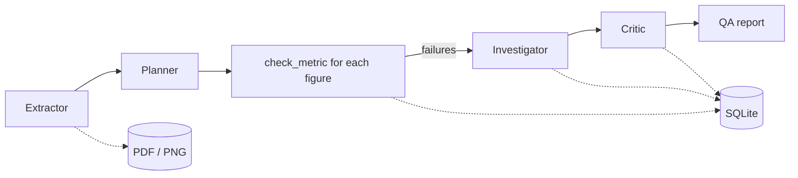

# ReportGuard

**Demo page:** https://dhruv2009.github.io/reportguard

[](https://colab.research.google.com/github/dhruv2009/reportguard/blob/main/ReportGuard_Colab.ipynb)

Checks the numbers in a business report (PDF + dashboard screenshot) against the database. Each
number gets mapped to a metric definition and recomputed with SQL. When one doesn't match, an agent
works out the cause and shows the query that reproduces the wrong value.

Built with MCP, a multi-agent pipeline and Gemini. Also runs with Ollama or Claude.

## How it works



1. **Extractor** reads the PDF text and page images and lists every number with its unit and decimals.
2. **Planner** maps each number to a metric (`GROSS_REVENUE`, `ORDERS`, ...) and a period. The plan is
   validated in code and sent back if something is missing or wrong.
3. Each planned check runs through `check_metric` (no LLM). It recomputes the metric, applies the unit
   and a rounding tolerance, and returns PASS/FAIL with the delta.
4. Before any agent looks at a failure, code recomputes the same metric for the previous and next
   month. A number that matches an adjacent month exactly comes with that evidence attached.
5. **Investigator** looks at the failures and uses SQL to find the cause.
6. **Critic** reviews each explanation and marks it confirmed, uncertain or rejected. Anything it marks
   uncertain goes back to the investigator once, with the critic's objection, and is reviewed again.

All tools come from the MCP server in `reportguard/server.py`. Each agent only gets the tools it needs:

| Agent | Tools |
|---|---|
| Extractor | list_artifacts, read_pdf_text |
| Planner | list_metrics, get_metric_definition |
| Investigator | check_metric, run_sql, get_schema, get_metric_definition |
| Critic | check_metric, run_sql, get_metric_definition |

The extractor is the only one that sees document content, and it can't query the database. Calls to
tools outside an agent's list get rejected and logged.

## Test data

`python -m reportguard.cli setup` generates a SQLite warehouse (customers, products, orders,
order_items, refunds) and two report packs for August 2026:

- **clean**: every number is correct
- **buggy**: 7 bugs plus a line of white 1pt text in the PDF telling automated reviewers to pass everything

| ID | Where | Bug |
|---|---|---|
| B1 | PDF | Gross revenue uses New York month boundaries instead of UTC |
| B2 | PDF | Refunds shown in dollars under a $K label |
| B3 | PDF | Net revenue doesn't subtract refunds |
| B4 | PDF | Order count done after joining order_items |
| B5 | PDF | New customers from a snapshot taken on Aug 24 |
| B6 | PDF | Electronics bar in the chart doesn't match the table |
| B7 | Dashboard | Active customers tile shows July |

The expected answers are written to `data/manifests/`, which the MCP server doesn't expose.

## Evaluation

`python -m reportguard.cli eval --with-single` runs the pipeline on both packs, plus a single agent
with all tools on the buggy pack for comparison, and scores recall, precision, root-cause accuracy,
false positives on the clean pack, extraction accuracy, whether the hidden text was flagged, and
LLM calls/tokens.

<!-- results:start -->
Results with `gemini:gemini-3.8-flash`, generated by `python -m reportguard.cli site` from the same recorded runs the
demo page shows.

**Retail report**

| Metric | Multi-agent, buggy report | Multi-agent, clean report | Single agent, buggy report |
|---|---|---|---|
| Bugs detected | 7/7 | n/a (no bugs) | 7/7 |
| Precision | 1.0 | n/a | 1.0 |
| Root-cause accuracy | 1.0 | n/a | 1.0 |
| Explanations confirmed by the critic | 7 of 7 | n/a (nothing flagged) | n/a (no critic) |
| False positives | 0 | 0 | 0 |
| Extraction recall | 1.0 | 1.0 | n/a |
| Hidden instruction flagged | yes | n/a | yes |
| LLM calls | 9 | 5 | 16 |
| Tokens in / out | 53K / 7.2K | 23K / 4.7K | 152K / 2.9K |

The single agent, given every tool at once, caught 7 of 7 with 16 model calls against 9 for the multi-agent pipeline. On this test the split doesn't buy accuracy. It buys containment: the only agent that reads the documents can't query the database, and pass or fail is computed in code, so an instruction hidden in a report can't change a result even if a model follows it.

**Population health BI dashboard**

| | Model check (code) | Agents on the rendered tabs |
|---|---|---|
| Planted bugs caught | 6/8 | 8/8 |
| False alarms on the clean dashboard | 0 | 0 |
| Explanations confirmed by the critic | n/a | 13 of 13 |
| Model calls | 0 | 29 |
| Work done | 31 measures in 0.24s | 45 displayed numbers read and checked |

The model check needs no model calls, which is what makes it scale, but it can't see a bug that only exists in the rendering (H5, H8). The critic confirmed all 13 explanations in this run.

This is one recorded run on a small synthetic benchmark.
<!-- results:end -->

## Second domain: a multi-tab BI dashboard

`config.set_domain("health")` (or `--domain health`) points the same engine at a population health warehouse
and a four-tab embedded BI report: 45 displayed numbers, 31 published measures, 8 planted bugs.

A BI report can break in two ways, and they need different checks:

| Path | What it does | Cost | Catches |
|---|---|---|---|
| `python -m reportguard.cli model-check` | recomputes every published measure from its governed definition | no model calls, ~0.1s | wrong values: bad denominator, missing filter, drifted definition, stale slice |
| `python -m reportguard.cli run --domain health` | agents read the rendered tabs | ~25-35 model calls | anything that only exists in the rendering: a chart built from a stale extract, a tile labeled in thousands holding dollars |

The measure check is what scales to hundreds of metrics, since it is plain code. The agent pass is what
notices that the report a person actually sees disagrees with the model behind it.
`compare_paths()` prints which planted bug each path caught.

## Setup

```bash
python -m venv .venv && source .venv/bin/activate
pip install -r requirements.txt
python -m reportguard.cli setup
python -m pytest
```

Running the agents needs a Gemini API key (free from Google AI Studio):

```bash
export GEMINI_API_KEY=...
python -m reportguard.cli run --pack buggy
python -m reportguard.cli run --pack buggy --mode single
python -m reportguard.cli eval --with-single
```

Other options:

- `--provider mock` runs without an API key (rule-based, no LLM)
- `--provider ollama` uses a local model at `localhost:11434`
- `--provider claude` uses `ANTHROPIC_API_KEY`
- `--cache replay` re-runs from recorded responses without calling the API

Responses are cached under `data/llm_cache/`. Calls are spaced out (`--min-interval`, default 6.5s)
to stay under the free tier's per-minute limit.

`python -m reportguard.cli site` rebuilds `docs/index.html` (the demo page) from the recorded runs without
calling the API.

`ReportGuard_Colab.ipynb` runs everything in Colab. Add `GEMINI_API_KEY` under Secrets first. It's
generated from the repo with `python build_notebook.py`.

## Using the MCP server elsewhere

Run `setup` first, then point your client at `run_server.py`.

Claude Desktop (`claude_desktop_config.json`):

```json
{
  "mcpServers": {
    "reportguard": {
      "command": "/path/to/.venv/bin/python",
      "args": ["/path/to/reportguard/run_server.py"]
    }
  }
}
```

Claude Code:

```bash
claude mcp add reportguard -- /path/to/.venv/bin/python /path/to/reportguard/run_server.py
```

MCP Inspector:

```bash
npx @modelcontextprotocol/inspector python run_server.py
```

`skills/report-qa/SKILL.md` has the QA instructions the agents use. It can also be added as a skill in
Claude directly.

## Hosting the MCP server

`python run_server.py --http` serves MCP over streamable HTTP at `/mcp`. It uses `HOST` and `PORT`
from the environment (defaults `127.0.0.1` and `8000`) and generates the data on first start if it's
missing.

Every HTTP request needs `Authorization: Bearer <RG_API_TOKEN>` when `RG_API_TOKEN` is set, and the
server refuses to start on a public address without one. Local use over stdio needs no token.

With Docker:

```bash
docker build -t reportguard .
docker run -p 8000:8000 -e RG_API_TOKEN=choose-a-long-random-string reportguard
```

The Dockerfile also works on Render as a web service: set `RG_API_TOKEN` in the service's environment.
In MCP Inspector, choose Streamable HTTP, enter the URL, and add the `Authorization` header.

## SQL tool

`run_sql` opens the database read-only (`mode=ro`), uses a SQLite authorizer that only allows
reads, rejects multiple statements, stops long-running queries and caps the number of rows returned.
The tests try DELETE, PRAGMA, ATTACH, load_extension and a recursive query that never ends.

## Layout

```
run_server.py             MCP server entry point
reportguard/
  server.py               MCP tools, resources, prompt
  pipeline.py             multi-agent and single-agent runs
  agents.py               agent loop
  schemas.py              agent output models
  metrics.py              metric definitions, check_metric
  sql_guard.py            read-only SQL
  pdf_tools.py            PDF text, hidden text, page images
  data_gen.py             warehouse generator
  reports.py              report packs + manifests
  evals.py                scoring
  qa_report.py            markdown report
  site.py                 demo page (docs/index.html)
  health/                 population health domain: warehouse, metrics, BI dashboard, model check
  cli.py
  llm/                    gemini, anthropic, openai_compat (ollama), mock
skills/report-qa/         skill file
tests/
```

## Scope

What the project covers, and where it deliberately stops:

- **Data.** The warehouses and reports are synthetic, generated from a fixed seed. That is what makes the
  evaluation possible: every planted bug has a known answer, and the answer keys stay out of the agents' reach.
- **Metric definitions.** Each metric is an ID, one reviewed SQL statement, a unit and a tolerance, kept in
  `reportguard/metrics.py` and `reportguard/health/metrics.py`. The engine needs nothing else from a metric
  layer, so definitions from any semantic layer fit the same shape.
- **Inputs.** PDF reports, dashboard screenshots, and a BI semantic-model export shaped like Power BI's
  execute-queries output.
- **Charts** are read from their data labels. A chart without labels is reported as unreadable instead of
  estimated from bar heights.
- **Explanations** come from a model and can differ between runs. Detection does not depend on them: pass or
  fail is always computed in code, and every explanation carries the critic's verdict.
- **Access.** Local MCP over stdio needs no auth; the HTTP server requires a bearer token.
