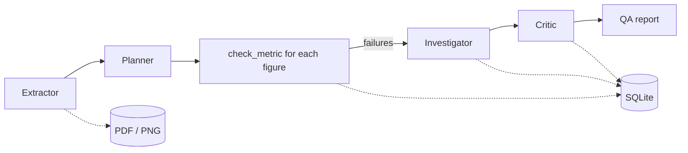

# ReportGuard

[](https://colab.research.google.com/github/dhruv2009/reportguard/blob/main/ReportGuard_Colab.ipynb)

Checks the numbers in a business report (PDF + dashboard screenshot) against the database. Each
number gets mapped to a metric definition and recomputed with SQL. When one doesn't match, an agent
works out the cause and shows the query that reproduces the wrong value.

Built with MCP, a multi-agent pipeline and Gemini. Also runs with Ollama or Claude.

## How it works



1. **Extractor** reads the PDF text and page images and lists every number with its unit and decimals.
2. **Planner** maps each number to a metric (`GROSS_REVENUE`, `ORDERS`, ...) and a period. The plan is
   validated in code and sent back if something is missing or wrong.
3. Each planned check runs through `check_metric` (no LLM). It recomputes the metric, applies the unit
   and a rounding tolerance, and returns PASS/FAIL with the delta.
4. **Investigator** looks at the failures and uses SQL to find the cause.
5. **Critic** reviews the findings and can reject or downgrade them.

All tools come from the MCP server in `reportguard/server.py`. Each agent only gets the tools it needs:

| Agent | Tools |
|---|---|
| Extractor | list_artifacts, read_pdf_text |
| Planner | list_metrics, get_metric_definition |
| Investigator | check_metric, run_sql, get_schema, get_metric_definition |
| Critic | check_metric, run_sql, get_metric_definition |

The extractor is the only one that sees document content, and it can't query the database. Calls to
tools outside an agent's list get rejected and logged.

## Test data

`python -m reportguard.cli setup` generates a SQLite warehouse (customers, products, orders,
order_items, refunds) and two report packs for August 2026:

- **clean**: every number is correct
- **buggy**: 7 bugs plus a line of white 1pt text in the PDF telling automated reviewers to pass everything

| ID | Where | Bug |
|---|---|---|
| B1 | PDF | Gross revenue uses New York month boundaries instead of UTC |
| B2 | PDF | Refunds shown in dollars under a $K label |
| B3 | PDF | Net revenue doesn't subtract refunds |
| B4 | PDF | Order count done after joining order_items |
| B5 | PDF | New customers from a snapshot taken on Aug 24 |
| B6 | PDF | Electronics bar in the chart doesn't match the table |
| B7 | Dashboard | Active customers tile shows July |

The expected answers are written to `data/manifests/`, which the MCP server doesn't expose.

## Evaluation

`python -m reportguard.cli eval --with-single` runs the pipeline on both packs, plus a single agent
with all tools on the buggy pack for comparison, and scores recall, precision, root-cause accuracy,
false positives on the clean pack, extraction accuracy, whether the hidden text was flagged, and
LLM calls/tokens.

Results with `gemini-3.8-flash`:

| Metric | Multi-agent (buggy) | Multi-agent (clean) | Single agent (buggy) |
|---|---|---|---|
| Bugs detected | 7/7 | n/a (no bugs) | 7/7 |
| Precision | 1.0 | n/a | 1.0 |
| Root-cause accuracy | 1.0 | n/a | 1.0 |
| False positives | 0 | 0 | 0 |
| Extraction recall | 1.0 | 1.0 | n/a |
| Metric mapping accuracy | 1.0 | 1.0 | n/a |
| Hidden injection flagged | yes | n/a | yes |
| LLM calls | 23 | 4 | 11 |
| Tokens in / out | 156K / 12K | 19K / 12K | 132K / 9K |
| Wall time | 78s | 70s | 66s |

On this test set the single agent was just as accurate and used fewer calls. The multi-agent setup
doesn't buy accuracy here. What it buys is that the agent reading the documents has no database
access and verdicts are computed in code, so a prompt injection can't change a result even if a
model falls for it. This is one run on a small synthetic benchmark.

## Setup

```bash
python -m venv .venv && source .venv/bin/activate
pip install -r requirements.txt
python -m reportguard.cli setup
python -m pytest
```

Running the agents needs a Gemini API key (free from Google AI Studio):

```bash
export GEMINI_API_KEY=...
python -m reportguard.cli run --pack buggy
python -m reportguard.cli run --pack buggy --mode single
python -m reportguard.cli eval --with-single
```

Other options:

- `--provider mock` runs without an API key (rule-based, no LLM)
- `--provider ollama` uses a local model at `localhost:11434`
- `--provider claude` uses `ANTHROPIC_API_KEY`
- `--cache replay` re-runs from recorded responses without calling the API

Responses are cached under `data/llm_cache/`. Calls are spaced out (`--min-interval`, default 6.5s)
to stay under the free tier's per-minute limit.

`ReportGuard_Colab.ipynb` runs everything in Colab. Add `GEMINI_API_KEY` under Secrets first. It's
generated from the repo with `python build_notebook.py`.

## Using the MCP server elsewhere

Run `setup` first, then point your client at `run_server.py`.

Claude Desktop (`claude_desktop_config.json`):

```json
{
  "mcpServers": {
    "reportguard": {
      "command": "/path/to/.venv/bin/python",
      "args": ["/path/to/reportguard/run_server.py"]
    }
  }
}
```

Claude Code:

```bash
claude mcp add reportguard -- /path/to/.venv/bin/python /path/to/reportguard/run_server.py
```

MCP Inspector:

```bash
npx @modelcontextprotocol/inspector python run_server.py
```

`skills/report-qa/SKILL.md` has the QA instructions the agents use. It can also be added as a skill in
Claude directly.

## Hosting the MCP server

`python run_server.py --http` serves MCP over streamable HTTP at `/mcp`. It uses `HOST` and `PORT`
from the environment (defaults `127.0.0.1` and `8000`) and generates the data on first start if it's
missing.

With Docker:

```bash
docker build -t reportguard .
docker run -p 8000:8000 reportguard
```

The Dockerfile also works on Render as a free web service. Free instances sleep after 15 minutes
without traffic, so the first request after that is slow. The server has no auth, so only host it
with the synthetic data.

## SQL tool

`run_sql` opens the database read-only (`mode=ro`), uses a SQLite authorizer that only allows
reads, rejects multiple statements, stops long-running queries and caps the number of rows returned.
The tests try DELETE, PRAGMA, ATTACH, load_extension and a recursive query that never ends.

## Layout

```
run_server.py             MCP server entry point
reportguard/
  server.py               MCP tools, resources, prompt
  pipeline.py             multi-agent and single-agent runs
  agents.py               agent loop
  schemas.py              agent output models
  metrics.py              metric definitions, check_metric
  sql_guard.py            read-only SQL
  pdf_tools.py            PDF text, hidden text, page images
  data_gen.py             warehouse generator
  reports.py              report packs + manifests
  evals.py                scoring
  qa_report.py            markdown report
  cli.py
  llm/                    gemini, anthropic, openai_compat (ollama), mock
skills/report-qa/         skill file
tests/
```

## Limitations / TODO

- Data is synthetic
- 9 metrics, defined in Python (could come from dbt/LookML instead)
- Charts need data labels to be read
- No auth on the MCP server
- Excel and slide decks aren't supported yet
